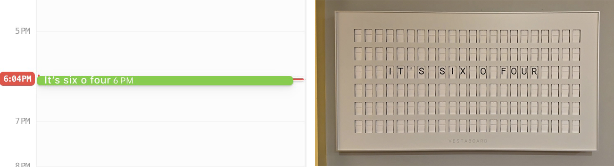

# Vestaboard Calendar

Use your calendar to schedule messages on a Vestaboard.



A Cloudflare worker to automate the display of Vestaboard messages using your existing online calendar.

## Related
- [Vestaboard API Docs](https://docs.vestaboard.com/docs/read-write-api/introduction)
- [Cloudflare Workers](https://developers.cloudflare.com/workers/s)

## Prerequisites

- [Node.js](https://nodejs.org/)
- [Wrangler](https://developers.cloudflare.com/workers/wrangler)

## Usage

### 1. Create a publicly accessible ICS calendar

#### Google Calendar

1. Go to [Google Calendar](https://calendar.google.com/)
2. Create a new calendar
3. Make it public
4. Get the ICS URL

### 2. Create a Vestaboard API key

1. Go to [Vestaboard](https://web.vestaboard.com/)
2. Create a new API key & make note of it.

### 3. Configure the worker on your computer.

1. Clone the repository
2. To run locally, create a `.dev.vars` file with the required environment variables

```bash
touch .dev.vars
```

It should look like this:

```bash
ICS_CALENDAR_URL=https://calendar.google.com/calendar/ical/your_calendar_id%40group.calendar.google.com/public/basic.ics
VESTABOARD_API_KEY=replace_with_your_api_key
```


### 4. Test the worker locally

```bash
npm wrangler dev
```

### 5. Deploy the worker to Cloudflare

To register your environment variables with Wrangler, run the following commands in your terminal.
This may require logging into your Cloudflare account & creating a new Worker, all of which are free & can be done as part of this process.

```bash
./node_modules/.bin/wrangler secret put ICS_CALENDAR_URL
./node_modules/.bin/wrangler secret put VESTABOARD_API_KEY
```

4. To deploy to Cloudflare & start running the worker, run the following command in your terminal:

```bash
npm run deploy
```

## License

This project is licensed under the MIT License - see the [LICENSE](LICENSE) file for details.